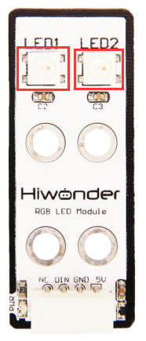

# 1. RGB Follower User Guide

## 1.1 RGB Module Description

### 1.1.1 RGB Module Introduction

Hiwonder RGB Module's control system can deliver dynamic lighting effects such as flowing light, flashing, and rainbow patterns. It also features LEGO-compatible mounting holes, which are available for multi-DIY designs.

### 1.1.2 Working Principle

It uses two adjustable full-color RGB LEDs, each supporting independent control. You can set the brightness of each RGB LED individually, enabling multicolor mixing effects.

## 1.2 Notice

1.  Do not exceed the rated voltage range during use.

2.  Do not keep the RGB LEDs at their maximum brightness for too long to prevent overheating damage. Power off after extended use to cool down the device.

## 1.3 Specifications

For more information, you may refer to "**[RGB sensor schematic](https://drive.google.com/drive/folders/1G7pTkdlmb3WEgjRf42nPsM6fBy-SkkC0?usp=sharing).**"

### 1.3.1 Pin Instruction

| **Pin** | **Instruction**      |
| :------ | :------------------- |
| 5V      | Power Input          |
| GND     | Ground               |
| DIN     | Digital Signal Input |
| NC      | None                 |

### 1.3.2 Specifications

<table class="docutils-nobg" border="1">
<colgroup><col style="width: 50%" />
<col style="width: 50%" /></colgroup>
<tbody>
<tr>
<td colspan="2" style="text-align: center;">
<strong>Touch Sensor</strong>
</td>
</tr>
<tr>
<td style="text-align: center;">
<strong>Parameter</strong>
</td>
<td style="text-align: center;">
<strong>Specification</strong>
</td>
</tr>
<tr>
<td style="text-align: center;">
<strong>Power Supply</strong>
</td>
<td style="text-align: center;">
<strong>DC 5V</strong>
</td>
</tr>
<tr>
<td style="text-align: center;">
<strong>Operating Current</strong>
</td>
<td style="text-align: center;">
<strong>50mA</strong>
</td>
</tr>
<tr>
<td style="text-align: center;">
<strong>Connector Type</strong>
</td>
<td style="text-align: center;">
<strong>5264-4AW</strong>
</td>
</tr>
<tr>
<td style="text-align: center;">
<strong>Number of Pins</strong>
</td>
<td style="text-align: center;">
<strong>4</strong>
</td>
</tr>
<tr>
<td style="text-align: center;">
<strong>Indicator Light (PWR) Description</strong>
</td>
<td style="text-align: center;">
<strong>The PWR LED lights up when powered.</strong>
</td>
</tr>
<tr>
<td style="text-align: center;">
<strong>Product Dimensions</strong>
</td>
<td style="text-align: center;">
<strong>50mmx20mm</strong>
</td>
</tr>
<tr>
<td colspan="2" style="text-align: center;">
<strong>Two RGB multicolor LEDs, each controllable independently.</strong>
</td>
</tr>
<tr>
<td colspan="2" style="text-align: center;">
<strong>Each individual LED can display red, green, and blue separately, or a mixed color.</strong>
</td>
</tr>
<tr><td colspan="2" style="text-align: center;">
<strong>Modular installation, compatible with Lego series.</strong>
</td>
</tr>
</tbody>
</table>