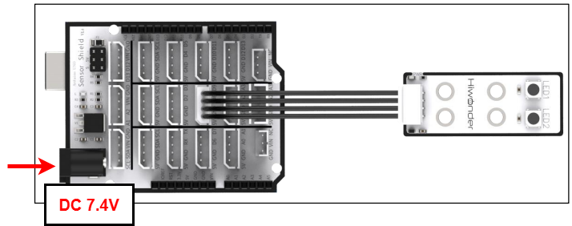
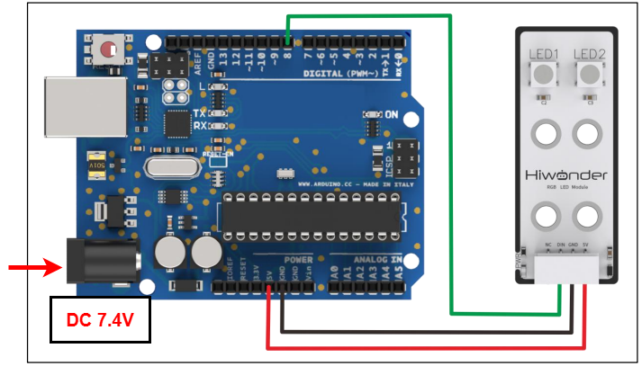
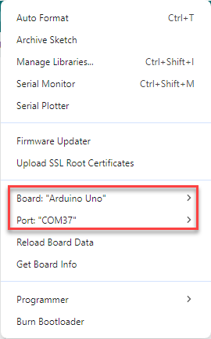

# 2. Arduino Development


##  2.1 Getting Started

### 2.1.1 Wiring Instruction

This section illustrates connecting a 4-pin cable to the D8 and D9 ports on the Arduino expansion board. You may refer to the diagram below.



If you do not have an Arduino expansion board, use a Dupont wire to directly connect to the Arduino development board, just as below:



> [!NOTE]
>
> * When using Hiwonder's lithium battery, connect the battery cable with the red wire to the positive (+) terminal and the black wire to the negative (–) terminal of the DC port.
>
> * If the battery is not connected to the cables, do not connect the cable ends directly together. Doing so may cause a short circuit and damage the system.
>
> * Before powering on, ensure that no metal objects are touching the controller; otherwise, the exposed pins at the bottom of the controller could cause short-circuit damage.

### 2.1.2 Environment Configuration

You can install the Arduino IDE on a PC. Download path: "[**Appendix->Arduino Installation Package**](https://drive.google.com/drive/folders/1GgIxrNbL86AO1R1RET4d_gF_jjKIjdpn?usp=sharing)" For more information, please refer to the same directory.

## 2.2 Test Case

Program to control RGB sensor lights using the Arduino board.

### 2.2.1 Program Download

1. For the Arduino and UNO development board equipped with the expansion board, use a USB cable to connect them to the computer. You can open Arduino IDE, click **"File → New,**" and import the program located in the same directory as this tutorial.

2. Remember to select the correct development board and port. The ports shown below are for reference only. Then compile and upload the program.



3. After the code is successfully uploaded, both RGB LEDs will simultaneously cycle through multiple colors, including red, green, blue, and white.

### 2.2.2 Project Outcome

After the code is successfully uploaded, both RGB LEDs will simultaneously cycle through multiple colors, including red, green, blue, and white.

### 2.2.3 Program Brief Analysis

- **Import Libraries**

```c++
#include <FastLED.h>   //Add the library for RGB LED control.
```

- **Custom interfaces**

```c++
#define NUM_LEDS 2   //Define the number of LEDs
#define DATA_PIN 8   //Define the signal pin
CRGB leds[NUM_LEDS]  //Create the LED strip (leds)
```

Program to define the interface of the RGB sensor, with the DIN pin connected to port D8. Define `NUM_LEDS` to set the number of LEDs to 2.

- **Serial Port Initialization**

```c++
void setup()
{
  delay(2000);
  FastLED.addLeds<WS2812, DATA_PIN, RGB>(leds, NUM_LEDS); // Initialize the LED control strip

}
```

Initialize the LED control strip here.

- **Loop Process**

```c++
void loop()
{
   leds[0] = CRGB(0,255,0); //Red
   leds[1] = CRGB(0,255,0);
   FastLED.show();
   delay(500);
   leds[0] = CRGB(255,0,0); //Green
   leds[1] = CRGB(255,0,0);
   FastLED.show();
   delay(500);
   leds[0] = CRGB(0,0,255); //Blue
   leds[1] = CRGB(0,0,255);
   FastLED.show();
   delay(500);
   leds[0] = CRGB(255,255,255); //White
   leds[1] = CRGB(255,255,255);
   FastLED.show();
   delay(500);
}
```

If you control both LEDs to light up simultaneously in the `loop()` function, they will light up in the following sequence: red, green, blue, and white.