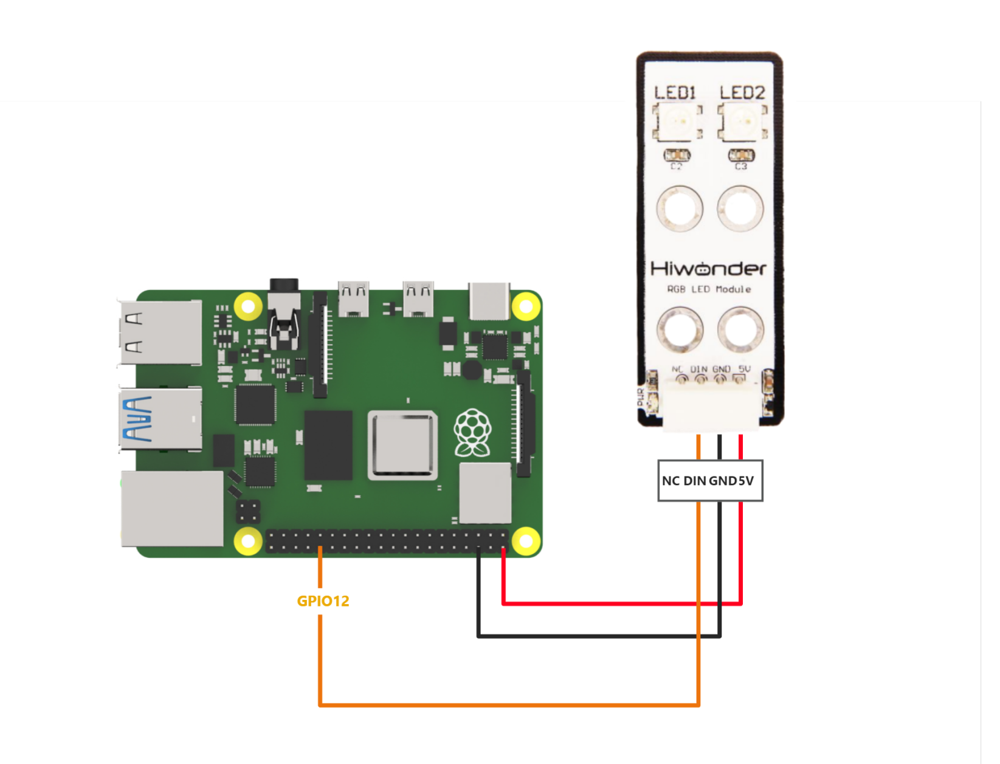

# 3. Raspberry Pi Development Tutorial


## 3.1 Getting Started

### 3.1.1 Wiring Instruction

This RGB sensor uses a Dupont wire connected to the Raspberry Pi for illustration. The sensor is connected to GPIO12 as shown below:



### 3.1.2 Environment Configuration

Install NoMachine software on PC. You can find it under "**[Appendix-> Remote Desktop Connection Tool](https://drive.google.com/drive/folders/1VOK5apFEK_CWEbtakSFTOkQVr3HcgS88?usp=sharing)**". For the detailed operations of NoMachine, please refer to the relevant tutorials.

Drag the program and SDK library files into the Raspberry Pi system image. For demonstration, the files are placed on the Desktop in this example. 

> [!NOTE]
>
> **Make sure the library files are placed in the same directory as the program.**

If it's not Hiwonder product image, you need to install `rpi_ws281x` library manually. You can find the installation steps here: 

```bash
sudo pip3 install rpi_ws281x
```

## 3.2 Test Case

Program to control two RGB LEDs on the RGB sensor using Raspberry Pi, with the LEDs cycling through red, green, and blue.

### 3.2.1 Program Download

1. Open the terminal and enter the command to navigate to the program directory (the Sensor_Demo folder here is an example): **cd Desktop/Sensor_Demo/**, then press Enter.

```bash
cd Desktop/Sensor_Demo/
```

2. To run this example program, enter: 

```bash
sudo python3 rgb_demo.py
```

### 3.2.2 Program Brief Analysis

- **Import Libraries**

```py
#!/usr/bin/env python3
import os
import sys
import time
import RPi.GPIO as GPIO
from smbus2 import SMBus, i2c_msg
from rpi_ws281x import PixelStrip
from rpi_ws281x import Color as PixelColor
```

Import the `RPi.GPIO` library to configure the pins and import the `rpi_ws281x` module to control the LEDs; the `time` library provide time-related operations.

- **Configure the RGB Sensor**

```py
__RGB_COUNT = 2
__RGB_PIN = 12
__RGB_FREQ_HZ = 800000
__RGB_DMA = 10
__RGB_BRIGHTNESS = 120
__RGB_CHANNEL = 0
__RGB_INVERT = False
RGB = PixelStrip(__RGB_COUNT, __RGB_PIN, __RGB_FREQ_HZ, __RGB_DMA, __RGB_INVERT, __RGB_BRIGHTNESS, __RGB_CHANNEL)
RGB.begin()
for i in range(RGB.numPixels()):
    RGB.setPixelColor(i, PixelColor(0,0,0))
    RGB.show()
```

Configure the number of RGB LEDs, pins, frequency, and other parameters, then initialize the RGB sensor and turn off all LEDs.

- **RGB Light Control**

```py
RGB.setPixelColor(0, PixelColor(0, 0, 0))
RGB.setPixelColor(1, PixelColor(0, 0, 0))
RGB.show()
```

The `RGB.setPixelColor()` function is used to control the color of an RGB LED. It has two parameters: the first specifies the index of the RGB LED to control, and the second specifies the color, which consists of three elements—R, G, and B. If all three elements are set to 0, the RGB LED is turned off. Use the `RGB.show()` function to display the set of RGB LED colors..

- **Main Function**

```py
if __name__ == '__main__':

    #Turn off all LEDs first(先将所有灯关闭)
    RGB.setPixelColor(0, PixelColor(0, 0, 0))
    RGB.setPixelColor(1, PixelColor(0, 0, 0))
    RGB.show()

    start = True
    while True:
        #Set two LEDs to red (两个灯设为红色)
        RGB.setPixelColor(0, PixelColor(255, 0, 0))
        RGB.setPixelColor(1, PixelColor(255, 0, 0))
        RGB.show()
        time.sleep(1) # 1-second delay (延时1秒)
        
        #Set both LEDs to green (两个灯设为绿色)
        RGB.setPixelColor(0, PixelColor(0, 255, 0))
        RGB.setPixelColor(1, PixelColor(0, 255, 0))
        RGB.show()
        time.sleep(1)
        
        #Set both LEDs to blue (两个灯设为蓝色)
        RGB.setPixelColor(0, PixelColor(0, 0, 255))
        RGB.setPixelColor(1, PixelColor(0, 0, 255))
        RGB.show()
        time.sleep(1) 
        
        if not start:
            #Turn off all LEDs (关闭所有灯)
            RGB.setPixelColor(0, PixelColor(0, 0, 0))
            RGB.setPixelColor(1, PixelColor(0, 0, 0))
            RGB.show()
            print('turn off')
            break
```

In the `main` function, turn off all RGB LEDs and enter the loop. First, you need to set the LEDs to red, then change them to green after 1 second, and finally to blue, continuously cycling through these three colors.